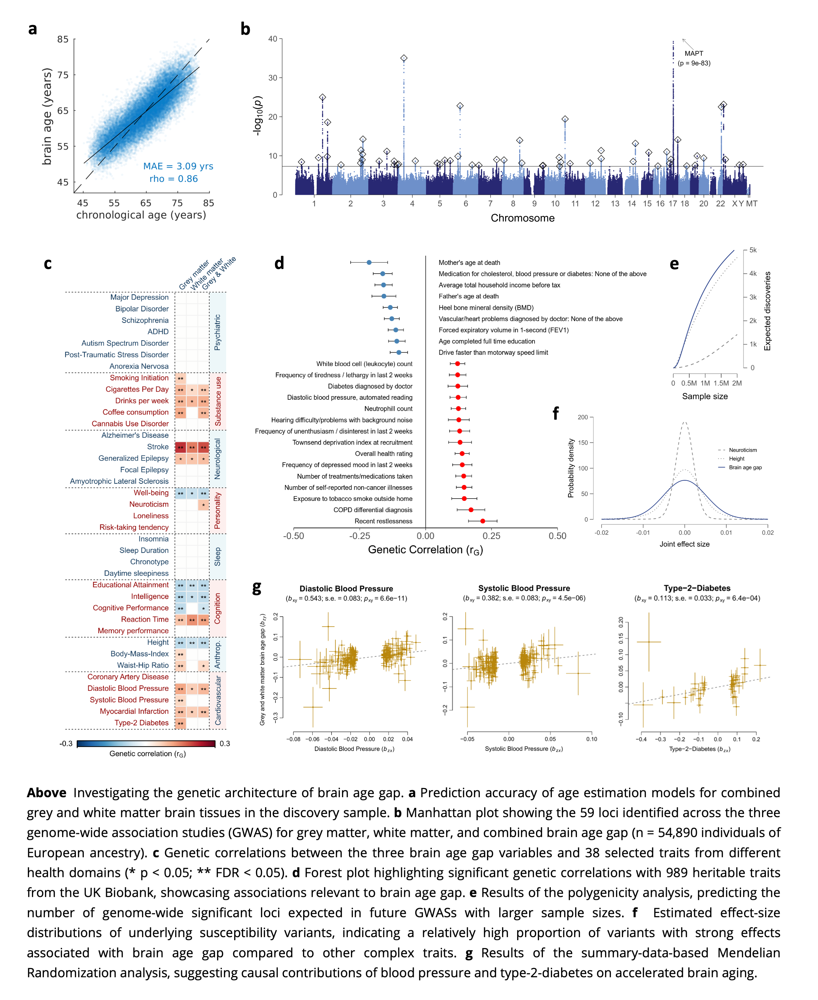

[](https://app.codacy.com/gh/pjawinski/ukb_brainage/dashboard?utm_source=gh&utm_medium=referral&utm_content=&utm_campaign=Badge_grade)
[](https://www.gnu.org/licenses/gpl-3.0)
[](https://doi.org/10.1101/2023.12.26.23300533)
[](https://bsky.app/profile/pjawinski.bsky.social)

# Genome-wide analysis of brain age gap identifies 59 associated loci and unveils relationships with mental and physical health
This repository contains the analysis scripts to reproduce the results presented in our article, "Genome-wide analysis of brain age gap identifies 59 associated loci and unveils relationships with mental and physical health". The individual-level data incorporated in this work have been obtained from the [UK Biobank](https://www.ukbiobank.ac.uk/) under [LIFE-Adult study](https://www.uniklinikum-leipzig.de/einrichtungen/life). Access to these datasets is restricted to researchers with approved projects. The GWAS summary statistics and polygenic score weights generated from our analyses are publicly available on [Zenodo](https://doi.org/10.5281/zenodo.14826943).

## Abstract
Neuroimaging and machine learning are advancing the study of biological aging mechanisms. In this field, ‘brain age gap’ has emerged as promising MRI-based biomarker quantifying the deviation between an individual’s biological and chronological age of the brain. Here, we conducted an in-depth genomic analysis of brain age gap and its relationships with over 1,000 health traits. Genome-wide analyses in up to 56,348 individuals unveiled a 23-29% SNP-based heritability and highlighted 59 associated loci (40 novel). The leading locus encompasses MAPT, encoding the tau protein central to Alzheimer's disease. Genetic correlations revealed relationships with mental health (e.g., depressed mood), physical health (e.g., diabetes), lifestyle (e.g., alcohol intake), and socioeconomic traits (e.g., income). Mendelian Randomization indicated a causal role of high blood pressure and type-2-diabetes in accelerated brain aging. Our study highlights key genes and pathways related to neurogenesis, immune-system-related processes, and small GTPases binding, laying the foundation for further mechanistic exploration.

Keywords: aging, genetics, machine learning, mental health, MRI

## Folder structure
[code/](code/) - contains preparation files, functions, and analysis scripts<br>
[envs/](envs/) - contains conda .yml files to recreate our environments<br>
[results/](results/) - contains result files (individual-level results are not provided due to data privacy policies)<br>
[run.mri.sh](run.mri.sh) - main analysis file for brain age gap estimations (phenotyping)<br>
[run.genetics.sh](run.genetics.sh) - main analysis file for genetic analyses<br>

## Software Environment
Analyses were run on **Debian GNU/Linux 11 (bullseye)** with  **kernel version 5.10.0-23-amd64**. The [code/prepare/](code/prepare/) directory contains scripts to facilitate the installation of the necessary bioinformatic tools for reproducing our analyses. For managing conda environments, we recommend using [mamba](https://mamba.readthedocs.io/en/latest/installation/mamba-installation.html), which offers faster dependency resolution and package installation compared to `conda`.

**Required Tools:**
Below is a list of the primary tools utilized in our analysis, along with their respective versions and roles:

- **[R](https://www.r-project.org/)** `3.5.1-4.4.1` | Statistical computing und plotting, included in conda environments
- **[MATLAB](https://de.mathworks.com/)** `R2021a` | MRI preprocessing and age-prediction
- **[SPM12](https://neuro-jena.github.io/cat/)** `r7487` | MRI preprocessing
- **[CAT12](https://neuro-jena.github.io/cat/)** `r1364` | MRI preprocessing
- **[RVM-MATLAB](https://github.com/iqiukp/RVM-MATLAB)** `v1.0.0` | Age-prediction
- **[XGBoost](https://github.com/iqiukp/RVM-MATLAB)** `v0.82.1` | Age-prediction
- **[PHESANT](https://github.com/MRCIEU/PHESANT)** `v1.1` | Cross-trait (phenome-wide) association analysis in UK Biobank
- **[ENIGMA Toolbox](https://github.com/MICA-MNI/ENIGMA)** `v2.0.3` for MATLAB | Visualizing cortical and subcortical surface associations
- **[PLINK 1.9](https://www.cog-genomics.org/plink/)** `v1.90b6.8` 64-bit | Genomic preprocessing
- **[PLINK 2.0](https://www.cog-genomics.org/plink/2.0/)** `v2.00a2LM` 64-bit Intel | Genomic preprocessing and genome-wide association analysis
- **[METAL](https://csg.sph.umich.edu/abecasis/Metal/)** `2020-05-05` | Fixed-effects meta-analysis in European ancestry samples
- **[MR-MEGA](https://genomics.ut.ee/en/tools)** `v0.2` | Multi-ancestry meta-analysis (meta-regression)
- **[GWAMA](https://genomics.ut.ee/en/tools)** `v2.2.2` | Multi-ancestry meta-analysis (random-effects)
- **[LOCUSZOOM](https://genome.sph.umich.edu/wiki/LocusZoom_Standalone)** `v1.4` standalone | Regional association plots
- **[GCTA](https://yanglab.westlake.edu.cn/software/gcta/)** `v1.93.1f beta` Linux | Conditional analysis, gene-based analysis, and Mendelian randomization
- **[SMR](https://yanglab.westlake.edu.cn/software/smr/#Overview)** `v1.3.0` | eQTL/sQTL Mendelian randomization
- **[LDSTORE](http://www.christianbenner.com)** `v2.0` x86/64 | Estimating and storing linkage-disequilibrium data
- **[FINEMAP](http://www.christianbenner.com)** `v1.4.2` | Identification of causal variants
- **[susieR](https://github.com/stephenslab/susieR)** `v0.12.35` | Identification of causal variants
- **[GCTB](https://cnsgenomics.com/software/gctb/)** `v2.5.2` | Identification of causal variants and polygenic score analysis using SBayesRC
- **[PRSice2](https://choishingwan.github.io/PRSice/)** `v2.3.3` | Polygenic score analysis
- **[MAGMA](https://cncr.nl/research/magma/)** `v1.10` | Gene-based analysis as input for PoPS
- **[PoPS](https://github.com/FinucaneLab/pops)** `v0.2` | Gene prioritization
- **[GENESIS](https://github.com/yandorazhang/GENESIS)** `e4e6894` | Polygenicity analysis


## Cloning the Repository
Navigate to your preferred local folder and clone this repository via the following commands:
```
git clone https://github.com/pjawinski/ukb_brainage
cd ukb_brainage
```

- To obtain and preprocess MRI files, refer to the steps outlined in [code/prepare.mri.sh](code/prepare.mri.sh) 
- For genetics file download and preparation, follow the instructions in [code/prepare.genetics.sh](code/prepare.genetics.sh)
- For a step-by-step guide through individual analysis processes, consult the primary analysis files [run.mri.sh](run.mri.sh) and [run.genetics.sh](run.genetics.sh)

## Results at a glance



## Contact
Philippe Jawinski | Humboldt-Universität zu Berlin | philippe.jawinski[at]hu-berlin.de <br>
Sebastian Markett | Humboldt-Universität zu Berlin | sebastian.markett[at]hu-berlin.de

