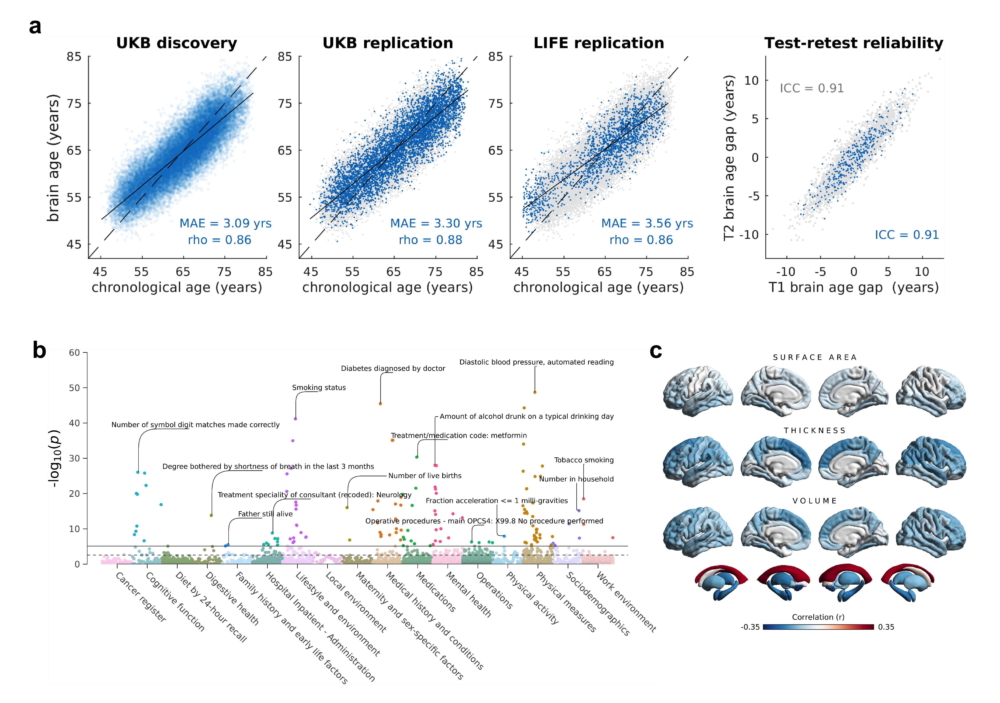
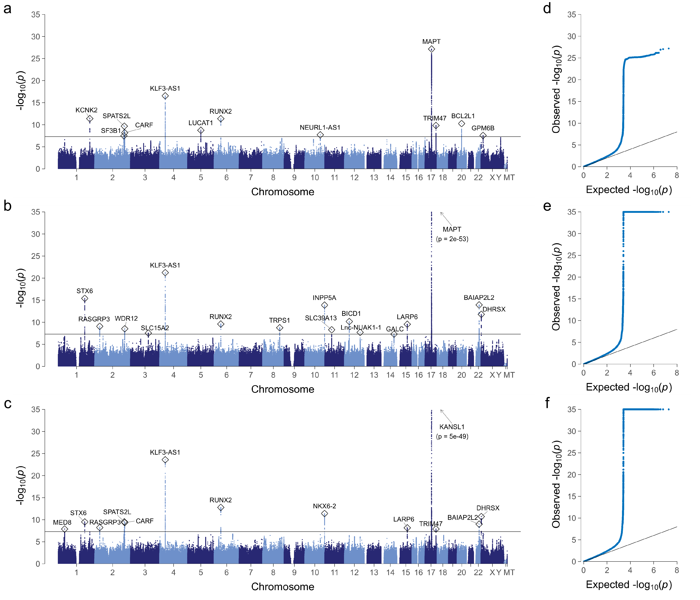
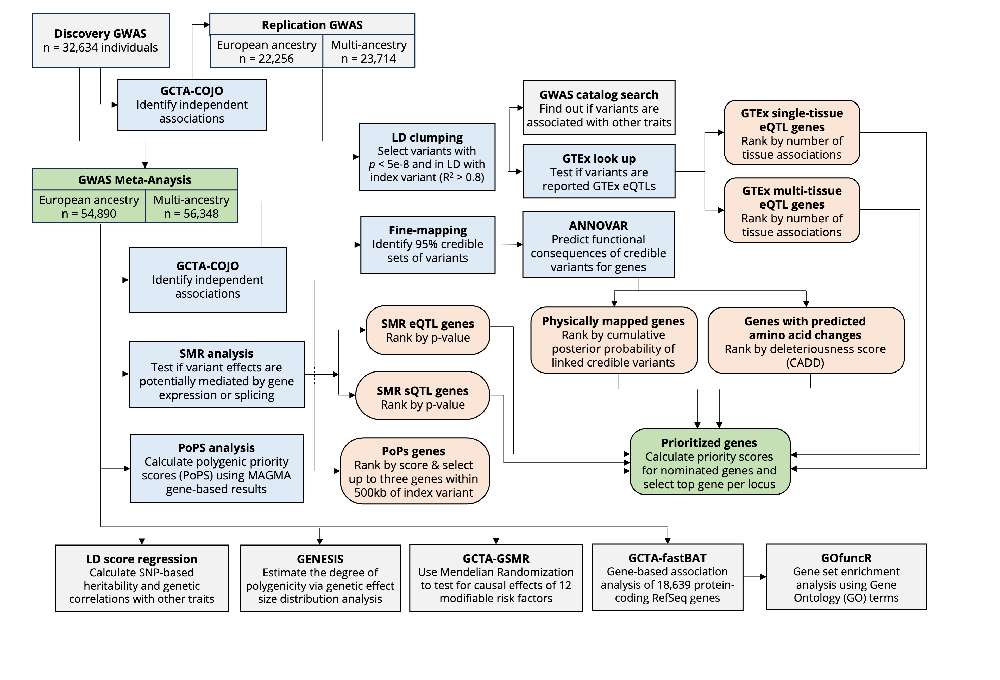
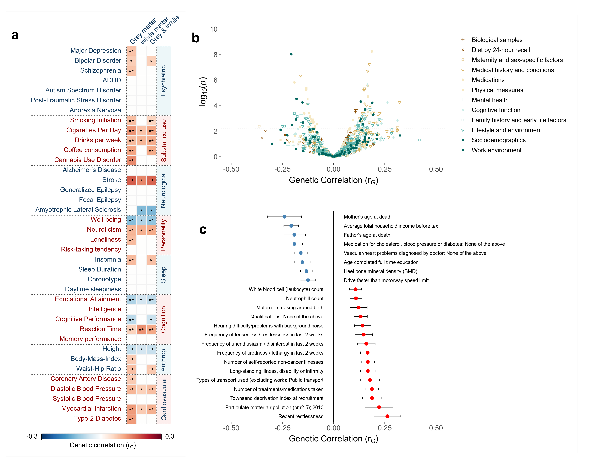
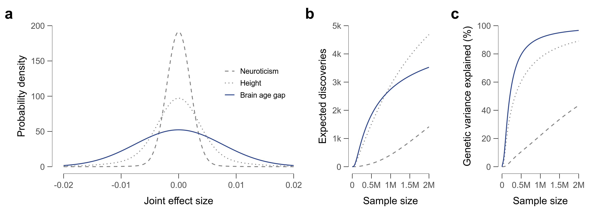

# Genome-wide analysis of brain age gap identifies 25 associated loci and unveils relationships with mental and physical health
This repository contains all the analysis scripts necessary to reproduce the results presented in our article entitled "Genome-wide analysis of brain age gap identifies 25 associated loci and unveils relationships with mental and physical health".

## Abstract
Neuroimaging and machine learning are opening up new opportunities in studying biological aging mechanisms. In this field, ‘brain age gap’ has emerged as promising MRI-based biomarker quantifying the deviation between an individual’s biological and chronological age of the brain – an indicator of accelerated/decelerated aging. Here, we investigated the genetic architecture of brain age gap and its relationships with over 1,000 health traits. Genome-wide analyses in 32,634 UK Biobank individuals unveiled a 30% SNP-based heritability and highlighted 25 associated loci. Of these, 23 showed sign-consistency and 16 replicated in another 7,259 individuals. The leading locus encompasses MAPT, encoding the tau protein central to Alzheimer's disease. Genetic correlations revealed relationships with various mental health (depression), physical health (diabetes), and socioeconomic variables (education). Mendelian Randomization indicated a causal role of enhanced blood pressure on accelerated brain aging. This work refines our understanding of genetically modulated brain aging and its implications for human health.

Keywords: aging, genetics, machine learning, mental health, MRI

## Folder structure
[code/](code/) - contains preparation files, functions, and analysis scripts<br>
[envs/](envs/) - contains conda .yml files to recreate our environments<br>
[results/](results/) - contains result files (individual-level results are not provided due to data privacy policies)<br>
[run.mri.sh](run.mri.sh) - main analysis file for brain age gap estimations (phenotyping)<br>
[run.genetics.sh](run.genetics.sh) - main analysis file for genetic analyses<br>

## Software requirements
Analyses were run on Debian GNU/Linux 11 (bullseye) with kernel version 5.10.0-23-amd64. Several scripts to install the required bioinformatic tools are provided in folder [code/prepare/](code/prepare/). We recommend [mamba](https://mamba.readthedocs.io/en/latest/installation/mamba-installation.html) for installing conda environments. A list of required tools is provided below.

- [CAT12](https://neuro-jena.github.io/cat/) (r1364)
- [PLINK](https://www.cog-genomics.org/plink/) v1.90b6.8 64-bit
- [PLINK](https://www.cog-genomics.org/plink/2.0/) v2.00a2LM 64-bit Intel
- [LOCUSZOOM](https://genome.sph.umich.edu/wiki/LocusZoom_Standalone) v1.4 standalone
- [GCTA](https://yanglab.westlake.edu.cn/software/gcta/) v1.93.1f beta Linux
- [SMR](https://yanglab.westlake.edu.cn/software/smr/#Overview) v1.3.0
- [LDSTORE](http://www.christianbenner.com) v2.0 x86/64
- [FINEMAP](http://www.christianbenner.com) v1.4.1
- [PRSice2](https://choishingwan.github.io/PRSice/) v2.3.3
- [PHESANT](https://github.com/MRCIEU/PHESANT)
- [PoPS](https://github.com/FinucaneLab/pops) v0.2
- [METAL](https://csg.sph.umich.edu/abecasis/Metal/) 2020-05-05

## Download
Navigate to your preferred local folder and clone this repository via the following commands:
```
git clone https://github.com/pjawinski/ukb_brainage
cd ukb_brainage
```

- To obtain and preprocess MRI files, refer to the steps outlined in [code/prepare.mri.sh](code/prepare.mri.sh) 
- For genetics file download and preparation, follow the instructions in [code/prepare.genetics.sh](code/prepare.genetics.sh)
- For a step-by-step guide through individual analysis processes, please see the primary analysis files [run.mri.sh](run.mri.sh) and [run.genetics.sh](run.genetics.sh)


<br>


## Results at a glance

**Fig. 1**	Prediction accuracies and phenotypic associations for combined grey and white matter BAG. **(a)** Predicion accuracies. Blue dots in the first three plots (from left to right) show brain-predicted age estimates plotted against the chronological age in the UKB discovery sample (n = 32,634), UKB replication sample (n = 5,427), and LIFE-Adult replication sample (n = 1,883). To facilitate comparisons, results of the UKB discovery sample are also shown as grey dots in the background of the UKB replication and LIFE replication plots. At this stage, brain-predicted age estimates have not yet been bias-corrected for regression dilution as indicated by the linear regression line (solid) crossing the identity line (dashed). The fourth plot shows the test-retest reliabilities of brain age gap in a subset of the UKB discovery (grey dots, n = 3,625) and UKB replication sample (blue dots, n = 376). Brain age gap was bias-corrected for age, age2, sex, scanner site, and total intracranial volume. **(b)** Cross-trait association results between brain age gap and 7,088 UK Biobank phenotypes from different health domains (sex, age, age2, scanner site, total intracranial volume served as covariates). Horizontal lines indicate the Bonferroni-adjusted (solid) and FDR-adjusted (dashed) level of significance. The top associations per category have been annotated. **(c)** Surface plots showing the correlations between brain age gap and 220 FreeSurfer brain structure variables. Colors reflect the strength and direction of partial product-moment correlations (sex, age, age2, scanner site, total intracranial volume served as covariates). MAE: mean absolute error; rho: product-moment correlation coefficient. ICC: intraclass correlation coefficient (C,1).

<br><br>



**Fig. 2**	Manhattan plots (a-c) and quantile-quantile plots (d-f) showing the results of the discovery genome-wide association analyses for the three brain age gap traits (N = 32,634 UK Biobank individuals). Manhattan plots show the p-values (-log10 scale) of the tested genetic variations on the y-axis and base-pair positions along the chromosomes on the x-axis. The solid horizontal line indicates the threshold of genome-wide significance (p = 5E-8). Index variations are highlighted by circles and were annotated with those genes implicated by our gene prioritization analysis. Results of pseudoautosomal variations have been added to chromosome ‘X’. Quantile-quantile plots show the observed p-values from the association analysis vs. the expected p values under the null hypothesis of no effect (-log10 scale). For illustrative reasons, the y-axis has been truncated at p = 1e-35. **a,d** grey matter brain age gap; **b,e** white matter brain age gap; **c,f** combined grey and white matter brain age gap.

<br><br>



**Fig. 3**	Overview of the post-GWAS analysis workflow including the gene prioritization procedure. Green boxes represent data input (discovery GWAS) and output (prioritized genes). Blue boxes represent analyses whose outcomes were used for gene nomination and subsequent prioritization. Apricot-colored boxes reflect gene nomination categories. Grey boxes reflect all other analyses carried out to refine the genetic architecture of brain age gap such as heritability and polygenicity analyses. Genes were prioritized by integrating data from multiple strategies such as functional annotation of credible variants, summary-data-based Mendelian Randomization (SMR), GTEx eQTL lookups, and Polygenic Priority Scores (PoPS).


<br><br>



**Fig. 4**	Results from the genetic correlation analyses between brain age gap and 1,027 other complex phenotypes. **(a)** Genetic correlation matrix between brain age gap (columns) and 38 selected phenotypes from different health domains (rows). * p < 0.05 (nominal significance) ** FDR < 0.05 (level of significance after multiple testing-correction) **(b)** Volcano plot showing the magnitude (x-axis) and significance (y-axis) of genetic correlations between grey matter brain age gap and 989 traits examined by Neale and colleagues. The dashed horizontal line indicates the FDR-adjusted level of significance. **(c)** Forest plot showing the genetic correlation coefficients and standard errors for a subset of 23 exemplary traits that showed significant genetic correlations with grey matter brain age gap. 


<br><br>



**Fig. 5**	Results of the genetic effect size distribution analysis for combined grey and white matter brain age gap. Neuroticism and standing height serve as reference traits. **(a)** Effect-size distributions of underlying susceptibility variants. Wider tails indicate a greater proportion of susceptibility variants with large effect sizes. **(b)** Expected number of discoveries as function of sample size. **(c)** Expected proportion of genetic variance explained by genome-wide significant discoveries as a function of sample size.

